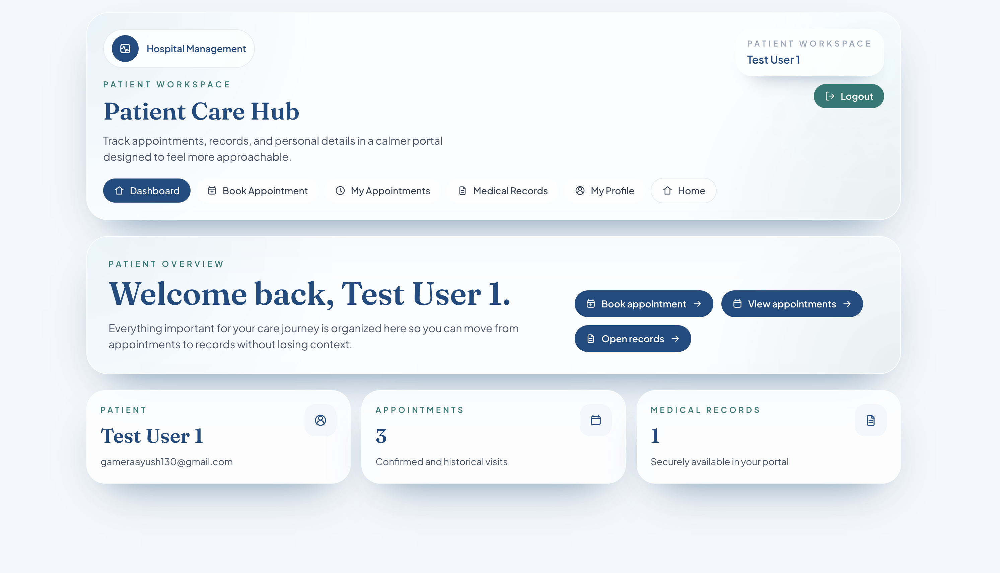

# Software-Engineering-Sprint-1

  Sprint 1 planning and design repository for the patient portal project.

  

## Project Summary

This repository captures the planning foundation for the patient portal. Sprint 1 is focused on shaping the product before implementation begins, so the main deliverables here are user stories, acceptance criteria, and visual design references.

The purpose of this repo is to make later development smoother by clearly documenting what needs to be built in Sprint 2 and Sprint 3.

> This repository is for planning and design reference. It is not the final implementation repository.

## Sprint 1 Goals

- define patient-focused user stories
- document clear acceptance criteria
- organize design references for the portal experience
- prepare a clean handoff for future implementation sprints

## Repository Guide

| Folder | Purpose |
| --- | --- |
| [user-stories](./user-stories) | Contains the patient portal user stories and acceptance criteria for Sprint 1. |
| [design-reference](./design-reference) | Presents the screenshots as structured design references for the planned portal screens. |
| [assets](./assets) | Stores the raw screenshots and supporting files used by the design reference pages. |

## Design Reference Approach

Formal wireframes were not available for this sprint, so polished interface screenshots are used as the visual reference for the planned patient portal.

These screenshots should be read as target UI direction for later implementation, not as evidence of completed code in this repository.

To explore the design material in more detail:

- view the full gallery in [design-reference/README.md](./design-reference/README.md)
- browse the source images in [assets](./assets)

## Planned Scope

Sprint 1 covers the planning and documentation for:

- patient registration and secure sign-in
- patient profile completion
- doctor browsing and slot selection
- appointment booking and appointment management
- password recovery flows
- dashboard and medical records experience

## Handoff to Future Sprints

This repo should support the next stages of the project:

- Sprint 2: implementation of core patient portal features
- Sprint 3: continued implementation, integration, and final refinement

The production code, setup instructions, and implementation-specific screenshots are expected to live in those later sprint repositories.
