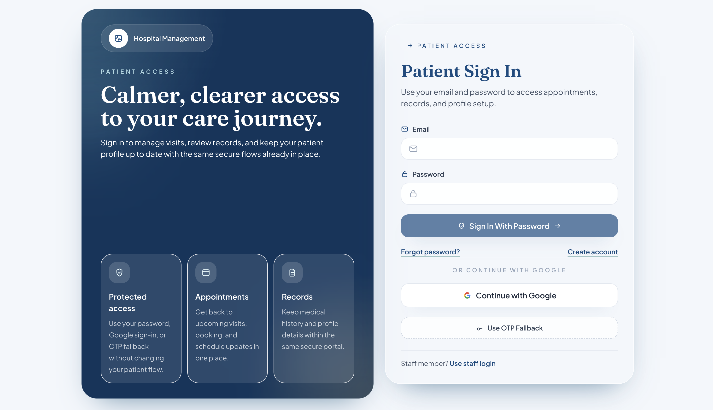
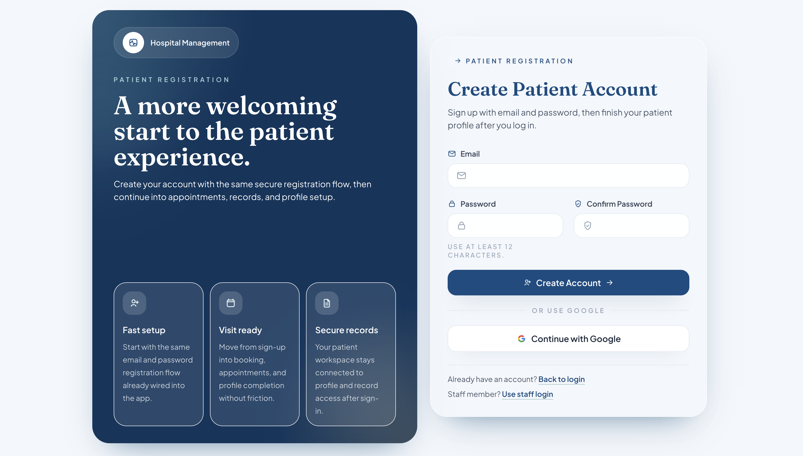
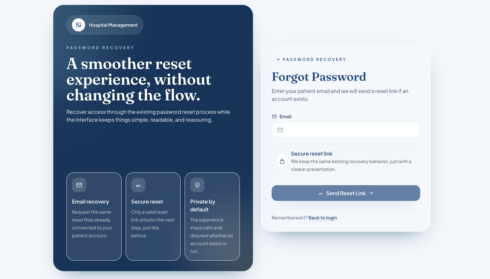
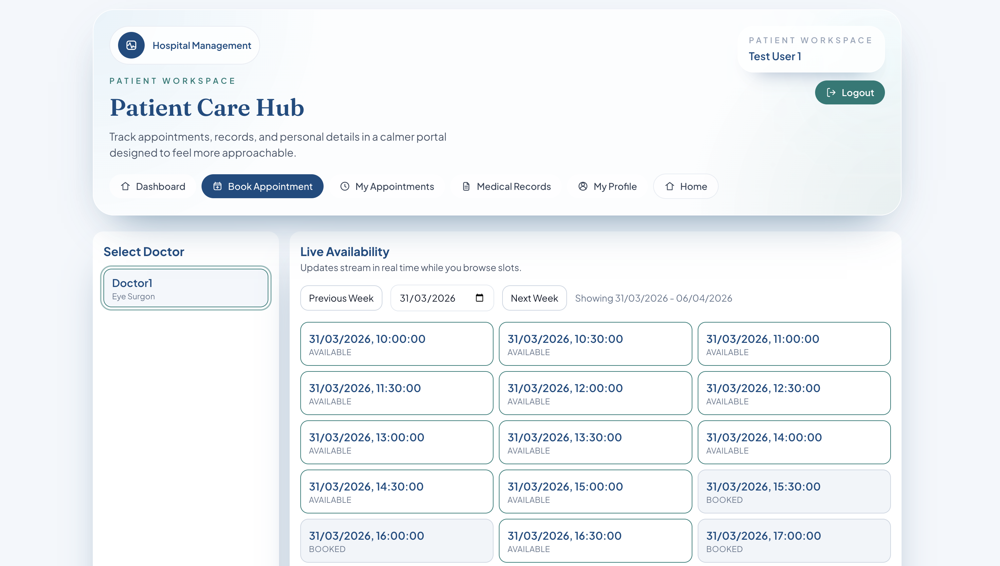
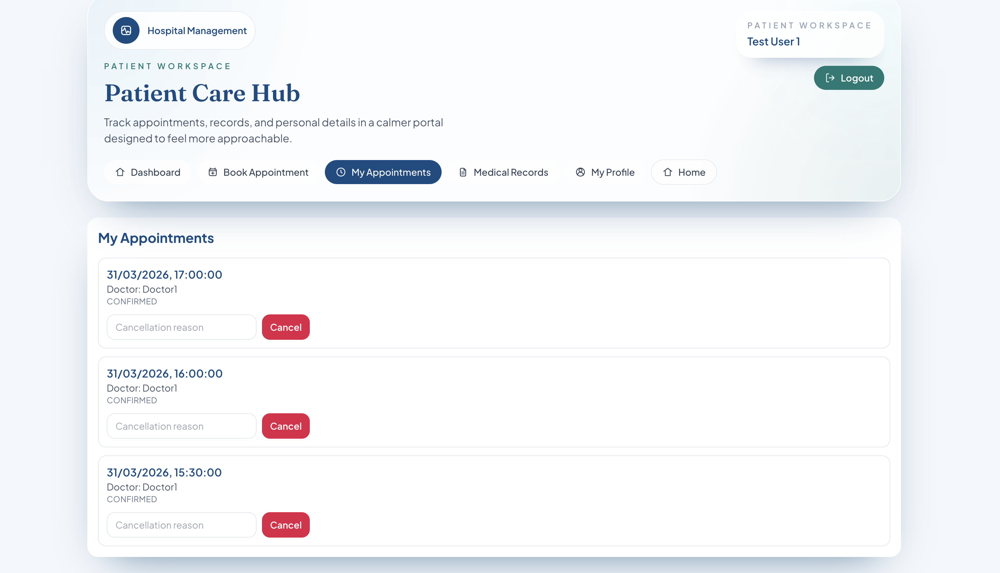
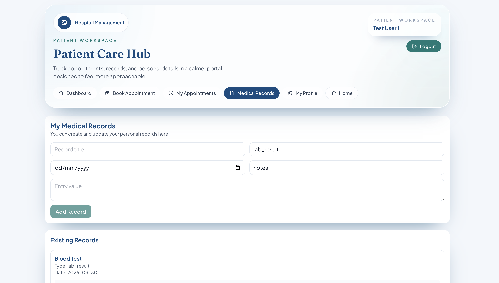
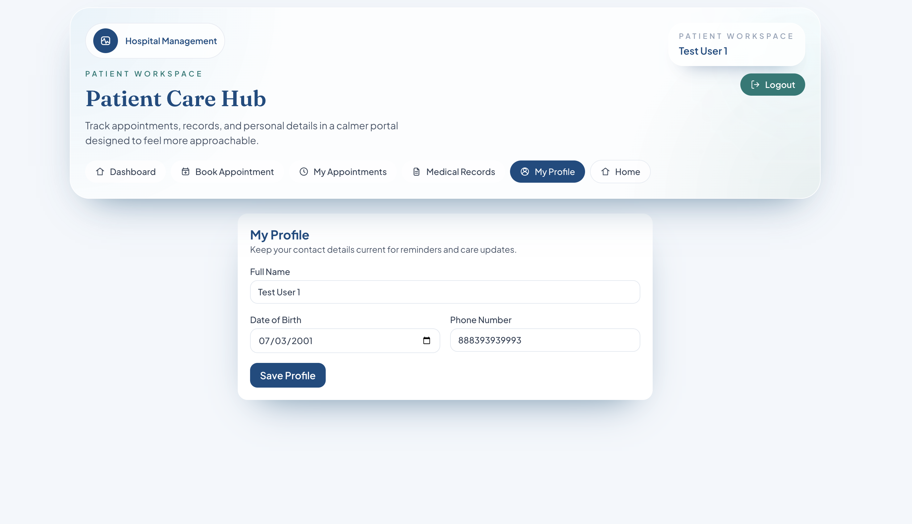
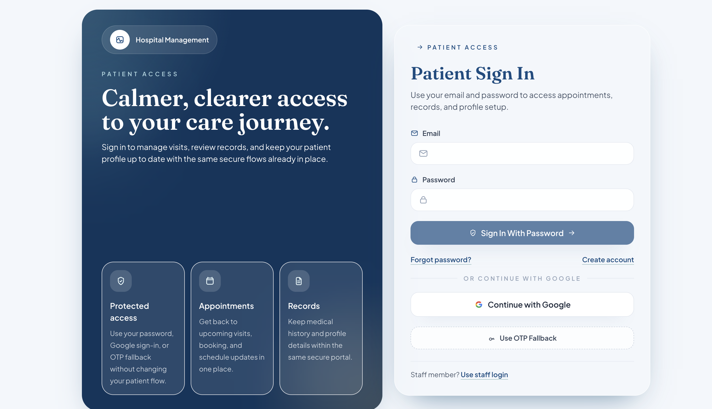

# Design Reference

This folder documents the visual direction for Sprint 1.

Because this sprint is focused on planning, user stories, and requirements rather than full implementation, the screenshots below are used as UI references for later build work in Sprint 2 and Sprint 3. The image files are stored in [../assets](../assets), while this folder explains how they support the planned patient portal experience.

## Authentication Screens

### Patient Sign In
Primary reference for secure login with email/password, Google sign-in, and OTP fallback.

### Patient Registration
Reference for account creation with email, password, and confirm password fields.

### Forgot Password
Reference for the password reset request flow.

## Patient Portal Screens

### Dashboard
Reference for the signed-in landing page, summary cards, and quick actions.

### Book Appointment
Reference for browsing doctors and viewing available appointment slots.

### My Appointments
Reference for reviewing booked visits and handling cancellations.

### Medical Records
Reference for viewing and managing patient medical record entries.

### My Profile
Reference for maintaining patient contact and profile details.

## Archived Variant

### Early Sign In Capture
An earlier sign-in screenshot kept as a supporting design resource.

